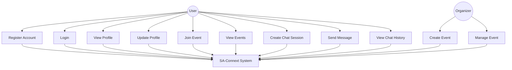
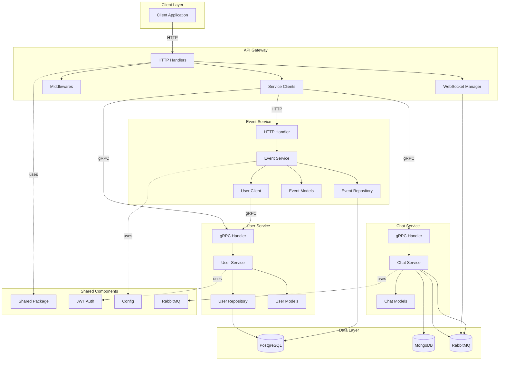
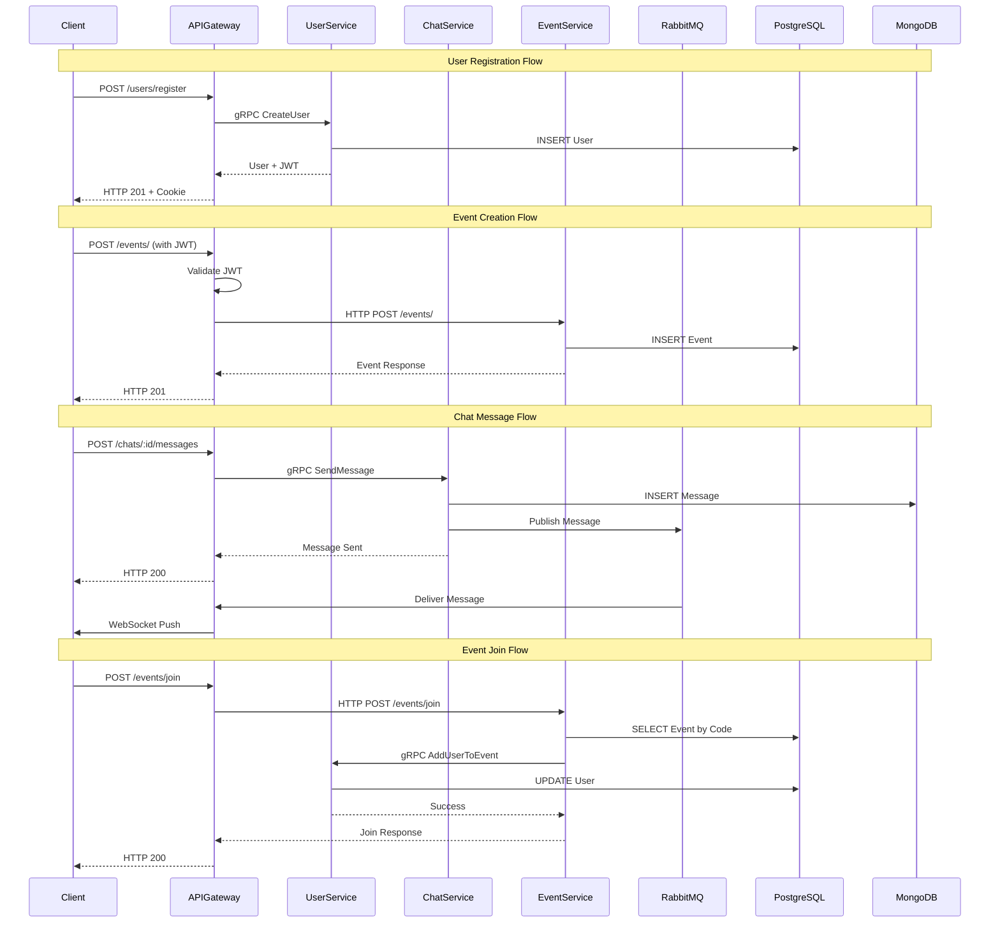
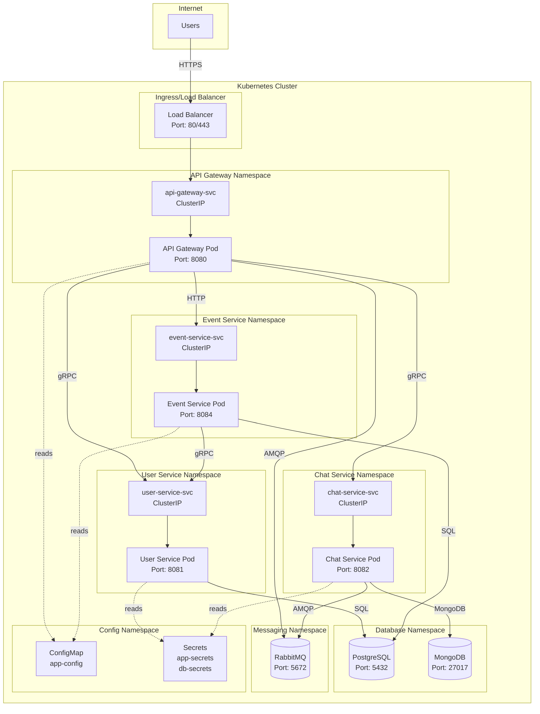
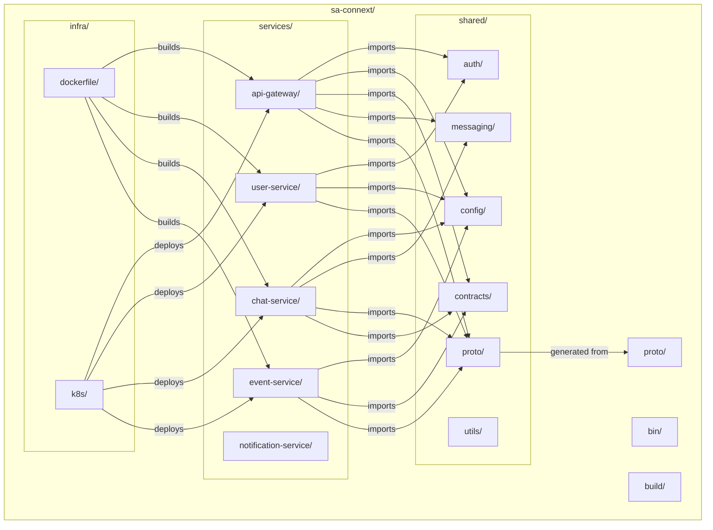

# Software Architecture Document

## 1. Introduction

### 1.1 Purpose

This Software Architecture Document provides a comprehensive architectural overview of the SA-Connext system, a microservices-based event networking and communication platform. The document describes the system's architectural design, including its decomposition into services, communication patterns, deployment architecture, and quality attributes. It serves as a reference for developers, architects, and stakeholders to understand the system's structure, design decisions, and technical implementation.

### 1.2 Scope

This document covers the architecture of the SA-Connext platform, which includes:

- **User Management Service**: Handles user registration, authentication, profile management, and user-event associations
- **Event Service**: Manages event creation, retrieval, joining, and user-event relationships
- **Chat Service**: Provides real-time messaging capabilities between users
- **Notification Service**: Handles asynchronous notifications (currently in development)
- **API Gateway**: Single entry point for all client requests, routing to appropriate services

The document describes the system's logical structure, process architecture, deployment configuration, implementation view, and quality attributes. It does not cover detailed implementation code, but rather focuses on architectural patterns, design decisions, and system organization.

### 1.3 Definitions, Acronyms, and Abbreviations

- **API Gateway**: Single entry point that routes client requests to appropriate microservices
- **gRPC**: Google Remote Procedure Call, a high-performance RPC framework
- **JWT**: JSON Web Token, used for authentication and authorization
- **RabbitMQ**: Message broker for asynchronous communication
- **MongoDB**: NoSQL document database
- **PostgreSQL**: Relational database management system
- **Kubernetes (K8s)**: Container orchestration platform
- **DTO**: Data Transfer Object
- **REST**: Representational State Transfer
- **AMQP**: Advanced Message Queuing Protocol

### 1.4 References

- Go Programming Language: https://golang.org/
- gRPC Documentation: https://grpc.io/docs/
- Fiber Framework: https://docs.gofiber.io/
- RabbitMQ Documentation: https://www.rabbitmq.com/documentation.html
- Kubernetes Documentation: https://kubernetes.io/docs/
- Protocol Buffers: https://developers.google.com/protocol-buffers

### 1.5 Overview

This document is organized into the following sections:

- **Section 2**: Architectural Representation - Describes the views used to represent the architecture
- **Section 3**: Architectural Goals and Constraints - Outlines key requirements and constraints
- **Section 4**: Use-Case View - Illustrates key use cases and their realizations
- **Section 5**: Logical View - Describes the system's decomposition into packages and classes
- **Section 6**: Process View - Explains the system's process architecture
- **Section 7**: Deployment View - Describes the physical deployment architecture
- **Section 8**: Implementation View - Details the implementation structure and layers
- **Section 9**: Data View - Describes persistent data storage
- **Section 10**: Size and Performance - Performance characteristics and constraints
- **Section 11**: Quality - Quality attributes and how the architecture supports them

## 2. Architectural Representation

The architecture of SA-Connext is represented using multiple views, each focusing on different aspects of the system:

### 2.1 Views Used

1. **Use-Case View**: Describes the system's functionality from an end-user perspective, showing how users interact with the system through key use cases.

2. **Logical View**: Represents the system's functional decomposition into services, packages, and classes. This view shows the static structure of the system.

3. **Process View**: Describes the system's runtime behavior, including processes, threads, and inter-process communication patterns.

4. **Deployment View**: Illustrates the physical deployment of the system, including containers, nodes, and network topology.

5. **Implementation View**: Shows the organization of source code, modules, and build artifacts.

6. **Data View**: Describes the persistent data models and storage strategies used across services.

### 2.2 Model Elements

- **Services**: Independent, deployable microservices (User Service, Chat Service, Event Service, Notification Service, API Gateway)
- **Clients**: gRPC and HTTP clients for inter-service communication
- **Handlers**: Request handlers that process incoming HTTP/gRPC requests
- **Services (Business Logic)**: Service layer containing business logic
- **Repositories**: Data access layer abstractions
- **Models**: Domain models and data structures
- **Contracts**: Shared interfaces and DTOs
- **Middleware**: Cross-cutting concerns (authentication, error handling)

## 3. Architectural Goals and Constraints

### 3.1 Architectural Goals

1. **Microservices Architecture**: The system is designed as a collection of loosely coupled, independently deployable services to enable scalability, maintainability, and technology diversity.

2. **High Availability**: Services are designed to be resilient and fault-tolerant, with the ability to scale horizontally.

3. **Performance**: The system uses efficient communication protocols (gRPC) and asynchronous messaging (RabbitMQ) to minimize latency and maximize throughput.

4. **Security**: JWT-based authentication ensures secure access to protected resources. All services validate tokens before processing requests.

5. **Scalability**: Each service can be scaled independently based on load. Stateless services enable horizontal scaling.

6. **Technology Diversity**: Services can use different technologies and databases best suited for their specific needs (PostgreSQL for relational data, MongoDB for document storage).

7. **Separation of Concerns**: Clear separation between API Gateway (routing), services (business logic), and data access (repositories).

### 3.2 Constraints

1. **Technology Stack**: 
   - Primary language: Go (Golang)
   - Web framework: Fiber (for HTTP services)
   - RPC framework: gRPC
   - Message broker: RabbitMQ
   - Databases: PostgreSQL, MongoDB

2. **Deployment**: 
   - Container-based deployment using Docker
   - Orchestration via Kubernetes
   - Services must be containerized and follow 12-factor app principles

3. **Communication Patterns**:
   - Synchronous: gRPC for User and Chat services, HTTP/REST for Event service
   - Asynchronous: RabbitMQ for event-driven communication (chat messages)

4. **Data Consistency**:
   - Eventual consistency acceptable for chat messages
   - Strong consistency required for user and event data

5. **Development Tools**:
   - Protocol Buffers for service contracts
   - Makefile for build automation
   - Environment-based configuration

6. **Team Structure**: Services are developed independently but share common contracts and utilities through the `shared` package.

7. **Legacy Code**: N/A - Greenfield project

8. **Schedule**: Services are developed incrementally, with API Gateway, User Service, Chat Service, and Event Service currently implemented.

## 4. Use-Case View

### 4.1 Key Use Cases

The following use cases represent significant functionality that exercises multiple architectural elements:

1. **User Registration and Authentication**
   - User registers with profile information
   - User logs in and receives JWT token
   - User accesses protected resources using JWT

2. **Event Management**
   - Organizer creates an event with details
   - System generates unique joining code
   - Users join events using joining codes
   - Users retrieve their events

3. **Real-Time Chat**
   - Users create chat sessions
   - Users send messages
   - Messages are delivered via WebSocket/RabbitMQ
   - Users retrieve chat history

4. **User Profile Management**
   - Users view and update their profiles
   - Users view other users' profiles

#### 4.1.1 Use Case Diagram

**Diagram File**: `diagrams/diagram-4-1-use-case.mmd`



### 4.2 Use-Case Realizations

#### 4.2.1 User Registration Flow

**Actors**: Client Application, API Gateway, User Service

**Flow**:
1. Client sends POST request to `/users/register` with user data
2. API Gateway receives request and forwards to User Service via gRPC
3. User Service validates input, hashes password, creates user record in PostgreSQL
4. User Service generates JWT token and returns to API Gateway
5. API Gateway sets JWT as HTTP-only cookie and returns success response

**Architectural Elements**:
- API Gateway Handler (`user_handler.go`)
- User Service gRPC Client (`user_client.go`)
- User Service gRPC Handler (`grpc_handler.go`)
- User Service Business Logic (`service.go`)
- User Repository (`repo.go`)
- PostgreSQL Database

#### 4.2.2 Event Creation and Joining Flow

**Actors**: Client Application, API Gateway, Event Service, User Service

**Flow**:
1. Authenticated user sends POST request to `/events/` with event details
2. API Gateway validates JWT token via middleware
3. API Gateway forwards request to Event Service via HTTP
4. Event Service validates input, generates unique joining code
5. Event Service creates event record in PostgreSQL
6. User joins event by sending POST to `/events/join` with joining code
7. Event Service validates joining code and calls User Service via gRPC to associate user with event
8. User Service updates user's current event association

**Architectural Elements**:
- API Gateway Event Handler (`event_handler.go`)
- Event Service HTTP Handler (`event_handler.go`)
- Event Service Business Logic (`event_service.go`)
- Event Repository (`event_repository.go`)
- User Service gRPC Client (from Event Service)
- PostgreSQL Database

#### 4.2.3 Chat Message Flow

**Actors**: Client Application, API Gateway, Chat Service, RabbitMQ

**Flow**:
1. User creates chat session via POST `/chats/` (if not exists)
2. User sends message via POST `/chats/:id/messages`
3. API Gateway forwards to Chat Service via gRPC
4. Chat Service saves message to MongoDB
5. Chat Service publishes message to RabbitMQ exchange
6. API Gateway consumes message from RabbitMQ queue
7. API Gateway delivers message to recipient via WebSocket connection

**Architectural Elements**:
- API Gateway Chat Handler (`chat_handler.go`)
- Chat Service gRPC Client (`chat_client.go`)
- Chat Service gRPC Handler (`service.go`)
- MongoDB Database
- RabbitMQ Message Broker
- Connection Manager (`connection_manager.go`)
- Queue Consumer (`queue_consumer.go`)

## 5. Logical View

### 5.1 Overview

The SA-Connext system is decomposed into five main microservices, each with distinct responsibilities:

1. **API Gateway**: Entry point for all client requests, handles routing, authentication, and WebSocket connections
2. **User Service**: Manages user accounts, authentication, and user-event associations
3. **Chat Service**: Handles chat sessions and message storage
4. **Event Service**: Manages events, joining codes, and event-user relationships
5. **Notification Service**: Handles asynchronous notifications (in development)

Each service follows a layered architecture:
- **Handler Layer**: Processes incoming requests (HTTP/gRPC)
- **Service Layer**: Contains business logic
- **Repository Layer**: Data access abstraction
- **Model Layer**: Domain models and data structures

#### 5.1.1 Logical Architecture Diagram

**Diagram File**: `diagrams/diagram-5-1-logical-architecture.mmd`



### 5.2 Architecturally Significant Design Packages

#### 5.2.1 API Gateway Service

**Location**: `services/api-gateway/`

**Description**: The API Gateway serves as the single entry point for all client requests. It handles routing, authentication middleware, and manages WebSocket connections for real-time chat.

**Key Components**:

- **Handlers** (`handlers/`):
  - `user_handler.go`: Handles user-related HTTP endpoints (register, login, profile management)
  - `chat_handler.go`: Manages chat endpoints and WebSocket connections
  - `event_handler.go`: Routes event-related requests to Event Service

- **Clients** (`clients/`):
  - `user_client.go`: gRPC client for User Service
  - `chat_client.go`: gRPC client for Chat Service
  - `event_client.go`: HTTP client for Event Service

- **DTOs** (`dto/`):
  - Request/Response DTOs for API contracts

- **Middlewares** (`pkg/middlewares/`):
  - JWT authentication middleware
  - Error handling middleware

**Responsibilities**:
- Route requests to appropriate microservices
- Validate JWT tokens for protected endpoints
- Manage WebSocket connections for real-time chat
- Consume messages from RabbitMQ and deliver via WebSocket
- Transform between HTTP and gRPC/HTTP service protocols

#### 5.2.2 User Service

**Location**: `services/user-service/`

**Description**: Manages user accounts, authentication, and user-event associations. Exposes gRPC interface for other services.

**Key Components**:

- **Handler** (`internal/handler/grpc_handler.go`):
  - Implements gRPC service interface
  - Processes CreateUser, Login, GetUserById, UpdateUser, AddUserToEvent requests

- **Service** (`internal/service/service.go`):
  - Business logic for user operations
  - Password hashing and validation
  - JWT token generation

- **Repository** (`internal/repository/repo.go`):
  - Data access layer for user operations
  - GORM-based PostgreSQL interactions

- **Models** (`internal/models/user.go`):
  - User, Contact, Education, Interest domain models

- **Mapper** (`internal/mapper/userMapper.go`):
  - Transforms between domain models and gRPC DTOs

**Responsibilities**:
- User registration and authentication
- User profile management
- User-event association management
- JWT token generation and validation

#### 5.2.3 Chat Service

**Location**: `services/chat-service/`

**Description**: Manages chat sessions and messages. Uses MongoDB for document storage and publishes messages to RabbitMQ for real-time delivery.

**Key Components**:

- **Service** (`internal/service/service.go`):
  - Implements gRPC ChatService interface
  - Creates chat sessions, sends messages, retrieves chats and messages
  - Publishes messages to RabbitMQ

- **Models** (`internal/models/models.go`):
  - Chat and Message MongoDB document models

- **Database** (`package/database/mongo.go`):
  - MongoDB connection and migration utilities

**Responsibilities**:
- Create and manage chat sessions between users
- Store and retrieve messages
- Publish messages to RabbitMQ for real-time delivery
- Maintain chat metadata (participants, timestamps)

#### 5.2.4 Event Service

**Location**: `services/event-service/`

**Description**: Manages events, generates joining codes, and coordinates with User Service for event-user associations.

**Key Components**:

- **Handler** (`internal/handler/event_handler.go`):
  - HTTP request handlers for event operations
  - Routes: CreateEvent, GetEvent, GetAllEvents, JoinEvent, GetEventsByUserID, DeleteEvent

- **Service** (`internal/service/event_service.go`):
  - Business logic for event operations
  - Joining code generation and validation
  - Coordinates with User Service via gRPC

- **Repository** (`internal/repository/event_repository.go`):
  - Data access layer for event operations
  - GORM-based PostgreSQL interactions

- **Models** (`internal/models/event.go`):
  - Event domain model

- **Client** (`internal/clients/user_client.go`):
  - gRPC client for User Service

**Responsibilities**:
- Create and manage events
- Generate unique joining codes
- Validate joining codes and associate users with events
- Retrieve events by various criteria

#### 5.2.5 Shared Package

**Location**: `shared/`

**Description**: Contains shared utilities, contracts, and generated code used across services.

**Key Components**:

- **Auth** (`auth/jwt.go`):
  - JWT token generation and validation utilities

- **Config** (`config/config.go`):
  - Centralized configuration management
  - Environment variable handling

- **Contracts** (`contracts/`):
  - Shared DTOs and interfaces (event.go, response.go, amqp.go, ws.go)

- **Messaging** (`messaging/`):
  - RabbitMQ connection and utilities
  - Queue consumer and connection manager

- **Proto** (`proto/`):
  - Generated gRPC code from .proto files

- **Utils** (`utils/utils.go`):
  - Common utility functions (e.g., event code generation)

**Responsibilities**:
- Provide common functionality across services
- Define shared contracts and interfaces
- Manage inter-service communication utilities

## 6. Process View

### 6.1 Process Architecture

The SA-Connext system consists of multiple independent processes, each running as a separate service:

1. **API Gateway Process**: Single-threaded HTTP server (Fiber framework) with goroutines for:
   - Request handling
   - RabbitMQ message consumption
   - WebSocket connection management

2. **User Service Process**: gRPC server handling concurrent requests via goroutines

3. **Chat Service Process**: gRPC server with goroutines for concurrent message processing

4. **Event Service Process**: HTTP server (Fiber framework) with goroutines for concurrent request handling

5. **Notification Service Process**: (In development)

#### 6.1.1 Process Interaction Diagram

**Diagram File**: `diagrams/diagram-6-1-process-interaction.mmd`



### 6.2 Inter-Process Communication

#### 6.2.1 Synchronous Communication

- **gRPC**: Used for communication between:
  - API Gateway ↔ User Service
  - API Gateway ↔ Chat Service
  - Event Service ↔ User Service

- **HTTP/REST**: Used for:
  - API Gateway ↔ Event Service
  - Client ↔ API Gateway

#### 6.2.2 Asynchronous Communication

- **RabbitMQ**: Used for:
  - Chat Service → API Gateway (message delivery)
  - Event-driven notifications (future use)

**Message Flow**:
1. Chat Service publishes message to RabbitMQ exchange (`chat`) with routing key (`chat.gateway`)
2. API Gateway consumes from queue (`gateway_chat`)
3. API Gateway delivers message to recipient via WebSocket

### 6.3 Process Groups

**Request Processing Group**:
- API Gateway receives HTTP requests
- Routes to appropriate service (gRPC or HTTP)
- Service processes request and returns response
- API Gateway returns HTTP response to client

**Real-Time Messaging Group**:
- Chat Service receives message via gRPC
- Saves to MongoDB
- Publishes to RabbitMQ
- API Gateway consumes from RabbitMQ
- Delivers via WebSocket to recipient

**Authentication Group**:
- Client includes JWT in request
- API Gateway middleware validates JWT
- Extracts user ID and attaches to request context
- Service processes authenticated request

## 7. Deployment View

### 7.1 Deployment Architecture

The system is designed for containerized deployment using Docker and Kubernetes orchestration.

#### 7.1.1 Container Architecture

Each service is containerized as a separate Docker container:

- **api-gateway**: Fiber HTTP server, exposes port 8080
- **user-service**: gRPC server, exposes port 8081
- **chat-service**: gRPC server, exposes port 8082
- **event-service**: Fiber HTTP server, exposes port 8084
- **notification-service**: (In development)

#### 7.1.2 Database Services

- **PostgreSQL**: Used by User Service and Event Service
  - Port: 5432 (internal), 5433 (external for development)
  - Database: `user-db`

- **MongoDB**: Used by Chat Service
  - Port: 27017

#### 7.1.3 Message Broker

- **RabbitMQ**: Message broker for asynchronous communication
  - Port: 5672 (AMQP), 15672 (Management UI)

### 7.2 Kubernetes Deployment

The system is deployed on Kubernetes with the following components:

#### 7.2.1 Services

- **api-gateway-svc**: ClusterIP service, port 8080
- **user-service-svc**: ClusterIP service, port 8081
- **chat-service-svc**: ClusterIP service, port 8082
- **event-service-svc**: ClusterIP service, port 8084

#### 7.2.2 Deployments

Each service has a corresponding Kubernetes Deployment with:
- Container image (built from Dockerfiles in `infra/dockerfile/`)
- Resource limits and requests
- Environment variables from ConfigMaps and Secrets
- Health checks (readiness and liveness probes)

#### 7.2.3 Configuration Management

- **ConfigMap** (`app-config.yaml`): Service addresses and database names
- **Secrets** (`app-secrets.yaml`, `db-secrets.yaml`): Sensitive configuration (JWT secrets, database credentials, RabbitMQ URI)

#### 7.2.4 Network Topology

```
Internet
  │
  ├─ Load Balancer / Ingress
  │
  └─ Kubernetes Cluster
      │
      ├─ API Gateway Pod (8080)
      │   ├─→ User Service Pod (8081) [gRPC]
      │   ├─→ Chat Service Pod (8082) [gRPC]
      │   ├─→ Event Service Pod (8084) [HTTP]
      │   └─→ RabbitMQ (5672) [AMQP]
      │
      ├─ User Service Pod (8081)
      │   └─→ PostgreSQL (5432)
      │
      ├─ Chat Service Pod (8082)
      │   ├─→ MongoDB (27017)
      │   └─→ RabbitMQ (5672) [AMQP]
      │
      └─ Event Service Pod (8084)
          ├─→ PostgreSQL (5432)
          └─→ User Service Pod (8081) [gRPC]
```

#### 7.2.5 Deployment Diagram

**Diagram File**: `diagrams/diagram-7-2-deployment.mmd`



### 7.3 Development Deployment

For local development, services can be run using:
- Docker Compose for databases and RabbitMQ
- Direct Go execution for services (via Makefile)
- Tilt for Kubernetes development (Tiltfile)

## 8. Implementation View

### 8.1 Overview

The implementation is organized into a monorepo structure with clear separation between services and shared code. Each service is independently buildable and deployable.

**Directory Structure**:
```
sa-connext/
├── services/          # Microservices
│   ├── api-gateway/
│   ├── user-service/
│   ├── chat-service/
│   ├── event-service/
│   └── notification-service/
├── shared/            # Shared code
│   ├── auth/
│   ├── config/
│   ├── contracts/
│   ├── messaging/
│   ├── proto/
│   └── utils/
├── proto/             # Protocol Buffer definitions
├── infra/             # Infrastructure as Code
│   ├── dockerfile/
│   └── k8s/
├── bin/               # Compiled binaries
└── build/             # Build artifacts
```

#### 8.1.1 Implementation Package Diagram

**Diagram File**: `diagrams/diagram-8-1-implementation-package.mmd`



#### 8.1.2 Service Layer Architecture Diagram

**Diagram File**: `diagrams/diagram-8-2-service-layer.mmd`

```mermaid
graph TB
    subgraph "API Gateway Service"
        AGMain[main.go]
        AGHandlers[handlers/]
        AGClients[clients/]
        AGDTO[dto/]
        AGMW[pkg/middlewares/]
        AGErrors[pkg/errors/]
    end
    
    subgraph "User Service"
        USMain[main.go]
        USCmd[cmd/]
        USHandler[internal/handler/]
        USService[internal/service/]
        USRepo[internal/repository/]
        USModel[internal/models/]
        USMapper[internal/mapper/]
        USDTO[internal/dto/]
    end
    
    subgraph "Chat Service"
        CSMain[main.go]
        CSService[internal/service/]
        CSModel[internal/models/]
        CSDB[package/database/]
    end
    
    subgraph "Event Service"
        ESMain[main.go]
        ESHandler[internal/handler/]
        ESService[internal/service/]
        ESRepo[internal/repository/]
        ESModel[internal/models/]
        ESClient[internal/clients/]
    end
    
    AGMain --> AGHandlers
    AGMain --> AGClients
    AGHandlers --> AGDTO
    AGHandlers --> AGMW
    AGHandlers --> AGErrors
    
    USMain --> USCmd
    USCmd --> USHandler
    USHandler --> USService
    USService --> USRepo
    USService --> USModel
    USService --> USMapper
    USHandler --> USDTO
    
    CSMain --> CSService
    CSService --> CSModel
    CSService --> CSDB
    
    ESMain --> ESHandler
    ESHandler --> ESService
    ESService --> ESRepo
    ESService --> ESModel
    ESService --> ESClient
```



### 8.2 Layers

#### 8.2.1 Service Layer

Each service follows a layered architecture:

**Handler/Controller Layer**:
- Processes incoming requests (HTTP/gRPC)
- Validates input
- Calls service layer
- Transforms responses

**Service/Business Logic Layer**:
- Contains business rules
- Coordinates between repositories and external services
- Transforms between DTOs and domain models

**Repository/Data Access Layer**:
- Abstracts database operations
- Implements data persistence logic

**Model/Domain Layer**:
- Domain models and entities
- Data structures

#### 8.2.2 Shared Layer

The `shared/` package provides:

- **Common Utilities**: Authentication, configuration, messaging
- **Contracts**: Shared DTOs and interfaces
- **Generated Code**: gRPC stubs from Protocol Buffers

#### 8.2.3 Build Layer

- **Makefile**: Build automation for all services
- **Dockerfiles**: Container definitions for each service
- **Kubernetes Manifests**: Deployment configurations

### 8.3 Component Organization

#### 8.3.1 API Gateway Implementation

```
services/api-gateway/
├── main.go                 # Entry point, service initialization
├── handlers/               # HTTP request handlers
│   ├── user_handler.go
│   ├── chat_handler.go
│   └── event_handler.go
├── clients/                # Service clients
│   ├── user_client.go
│   ├── chat_client.go
│   └── event_client.go
├── dto/                    # Data Transfer Objects
│   ├── users.go
│   ├── chats.go
│   └── events.go
└── pkg/
    ├── middlewares/        # HTTP middlewares
    └── errors/             # Error handling
```

#### 8.3.2 User Service Implementation

```
services/user-service/
├── main.go                 # Entry point
├── cmd/                    # CLI commands (Cobra)
│   ├── root.go
│   ├── serve.go
│   └── setup.go
└── internal/
    ├── handler/            # gRPC handlers
    ├── service/            # Business logic
    ├── repository/         # Data access
    ├── models/             # Domain models
    ├── dto/                # DTOs
    └── mapper/             # Model mappers
```

#### 8.3.3 Chat Service Implementation

```
services/chat-service/
├── main.go                 # Entry point
├── internal/
│   ├── service/            # gRPC service implementation
│   └── models/             # MongoDB models
└── package/
    └── database/           # MongoDB utilities
```

#### 8.3.4 Event Service Implementation

```
services/event-service/
├── main.go                 # Entry point
├── internal/
│   ├── handler/            # HTTP handlers
│   ├── service/            # Business logic
│   ├── repository/         # Data access
│   ├── models/             # Domain models
│   └── clients/            # User Service gRPC client
```

## 9. Data View

### 9.1 Data Storage Strategy

The system uses a polyglot persistence approach, selecting databases based on data characteristics:

- **PostgreSQL**: Used for structured, relational data (Users, Events)
- **MongoDB**: Used for document-based, flexible schema data (Chats, Messages)

### 9.2 Data Models

#### 9.2.1 User Service Data Model (PostgreSQL)

**User Table**:
- Primary Key: `id` (uint, auto-increment)
- Fields: `username`, `password` (hashed), `job_title`, `current_event_id`
- Relationships:
  - One-to-One with `Contact`
  - One-to-One with `Education`
  - One-to-Many with `Interest`

**Contact Table**:
- Primary Key: `id`
- Fields: `email` (unique), `phone`
- Foreign Key: `user_id` → User

**Education Table**:
- Primary Key: `id`
- Fields: `university`, `major`
- Foreign Key: `user_id` → User

**Interest Table**:
- Primary Key: `id`
- Fields: `name`
- Foreign Key: `user_id` → User

#### 9.2.2 Event Service Data Model (PostgreSQL)

**Event Table**:
- Primary Key: `id` (uint, auto-increment)
- Fields: `name`, `detail`, `location`, `date` (timestamp), `organizer_id`, `joining_code` (unique)
- Soft Delete: `deleted_at` (GORM soft delete)

#### 9.2.3 Chat Service Data Model (MongoDB)

**Chats Collection**:
- Document ID: `_id` (ObjectID)
- Fields: `participants` (array of user IDs), `created_at`, `updated_at`
- Index: On `participants` array for efficient queries

**Messages Collection**:
- Document ID: `_id` (ObjectID)
- Fields: `chat_id` (ObjectID reference), `sender_id`, `recipient_id`, `message`, `created_at`
- Index: On `chat_id` for efficient message retrieval

### 9.3 Data Flow

#### 9.3.1 User Registration Flow
1. Client → API Gateway: User registration data
2. API Gateway → User Service (gRPC): CreateUser request
3. User Service: Validates, hashes password, creates User, Contact, Education, Interest records
4. User Service → PostgreSQL: INSERT operations
5. User Service → API Gateway: User data + JWT token
6. API Gateway → Client: Success response with JWT cookie

#### 9.3.2 Event Creation Flow
1. Client → API Gateway: Event creation data
2. API Gateway → Event Service (HTTP): CreateEvent request
3. Event Service: Generates unique joining code, creates Event record
4. Event Service → PostgreSQL: INSERT Event
5. Event Service → API Gateway: Event data with joining code
6. API Gateway → Client: Success response

#### 9.3.3 Message Flow
1. Client → API Gateway: Send message request
2. API Gateway → Chat Service (gRPC): SendMessage request
3. Chat Service: Validates chat, creates Message document
4. Chat Service → MongoDB: INSERT Message, UPDATE Chat (updated_at)
5. Chat Service → RabbitMQ: Publish message to exchange
6. API Gateway: Consumes from RabbitMQ queue
7. API Gateway → Client: Deliver via WebSocket

### 9.4 Data Consistency

- **Strong Consistency**: User and Event data require strong consistency (PostgreSQL ACID transactions)
- **Eventual Consistency**: Chat messages can tolerate eventual consistency (MongoDB, RabbitMQ delivery)

### 9.5 Data Migration

- **PostgreSQL**: GORM AutoMigrate for schema management
- **MongoDB**: Manual migration scripts in `package/database/mongo.go`

## 10. Size and Performance

### 10.1 System Dimensions

**Services**:
- 5 microservices (4 implemented, 1 in development)
- Each service is a single Go binary (~10-50 MB compiled)

**Database Scale**:
- PostgreSQL: Expected to handle thousands of users and events
- MongoDB: Expected to handle millions of messages

**Message Throughput**:
- RabbitMQ: Designed to handle high message throughput for chat delivery
- WebSocket connections: Managed per user session

### 10.2 Performance Characteristics

#### 10.2.1 API Gateway
- **Request Latency**: < 50ms for routing (excluding downstream service time)
- **Concurrent Connections**: Supports thousands of concurrent HTTP connections
- **WebSocket Connections**: Manages active WebSocket connections per user

#### 10.2.2 User Service
- **gRPC Latency**: < 10ms for local service calls
- **Database Queries**: Optimized with indexes on `username`, `email`
- **JWT Generation**: < 5ms per token

#### 10.2.3 Chat Service
- **Message Storage**: < 20ms for MongoDB write operations
- **RabbitMQ Publishing**: < 10ms per message
- **Message Retrieval**: < 50ms for chat history queries

#### 10.2.4 Event Service
- **Event Creation**: < 30ms (including code generation)
- **Event Retrieval**: < 20ms for single event, < 100ms for list queries

### 10.3 Performance Constraints

1. **Network Latency**: Inter-service communication adds latency (mitigated by gRPC's efficiency)
2. **Database Connections**: Connection pooling limits concurrent database operations
3. **RabbitMQ Throughput**: Message broker capacity limits message delivery rate
4. **WebSocket Scalability**: Each WebSocket connection consumes server resources

### 10.4 Scalability Targets

- **Horizontal Scaling**: All services are stateless and can be scaled horizontally
- **Database Scaling**: PostgreSQL can be scaled via read replicas; MongoDB supports sharding
- **Message Broker**: RabbitMQ can be clustered for high availability and throughput

## 11. Quality

### 11.1 Extensibility

The architecture supports extensibility through:

1. **Microservices Pattern**: New services can be added without modifying existing ones
2. **Shared Contracts**: Protocol Buffers and shared DTOs enable versioned service interfaces
3. **Plugin Architecture**: Middleware system allows adding cross-cutting concerns
4. **Database Abstraction**: Repository pattern enables database technology changes

**Example**: Adding a new "Organizer Service" would involve:
- Creating new service with gRPC/HTTP interface
- Adding client in API Gateway
- Registering routes in API Gateway
- No changes to existing services

### 11.2 Reliability

Reliability is achieved through:

1. **Service Independence**: Failure in one service doesn't cascade to others
2. **Error Handling**: Comprehensive error handling at handler, service, and client layers
3. **Graceful Degradation**: Services can continue operating if non-critical dependencies fail
4. **Health Checks**: Kubernetes readiness and liveness probes ensure service health
5. **Message Persistence**: RabbitMQ persistent messages ensure message delivery

### 11.3 Security

Security measures include:

1. **Authentication**: JWT-based authentication with HTTP-only cookies
2. **Authorization**: Middleware validates tokens before processing protected requests
3. **Password Security**: Passwords are hashed (bcrypt) before storage
4. **Input Validation**: All inputs are validated at handler layer
5. **Secure Communication**: gRPC uses TLS in production; HTTPS for HTTP services
6. **Secret Management**: Sensitive data stored in Kubernetes Secrets

### 11.4 Maintainability

Maintainability is supported by:

1. **Clear Separation of Concerns**: Handler → Service → Repository layers
2. **Consistent Structure**: All services follow similar architectural patterns
3. **Shared Utilities**: Common functionality in `shared/` package reduces duplication
4. **Documentation**: Code comments and this architecture document
5. **Testing**: Unit and integration test capabilities (structure in place)

### 11.5 Portability

The system is portable through:

1. **Containerization**: All services containerized with Docker
2. **Configuration Management**: Environment-based configuration (no hardcoded values)
3. **Database Abstraction**: Repository pattern allows database technology changes
4. **Cloud Agnostic**: Can be deployed on any Kubernetes-compatible platform

### 11.6 Performance

Performance optimizations include:

1. **Efficient Protocols**: gRPC for inter-service communication (binary, HTTP/2)
2. **Connection Pooling**: Database connection pooling reduces connection overhead
3. **Asynchronous Messaging**: RabbitMQ enables non-blocking message delivery
4. **Caching Opportunities**: Service layer can implement caching (not currently implemented)
5. **Database Indexing**: Indexes on frequently queried fields

### 11.7 Testability

The architecture supports testing through:

1. **Dependency Injection**: Services accept interfaces, enabling mock injection
2. **Repository Pattern**: Database operations can be mocked
3. **Service Isolation**: Each service can be tested independently
4. **Contract Testing**: Protocol Buffers enable contract-based testing

### 11.8 Observability

Observability capabilities (to be enhanced):

1. **Logging**: Structured logging throughout services
2. **Error Tracking**: Centralized error handling
3. **Metrics**: Can be added via Prometheus integration
4. **Tracing**: Can be added via OpenTelemetry integration

---

## Document Version History

| Version | Date | Author | Changes |
|---------|------|--------|---------|
| 1.0 | 2024 | Architecture Team | Initial architecture document |

---

**End of Document**

